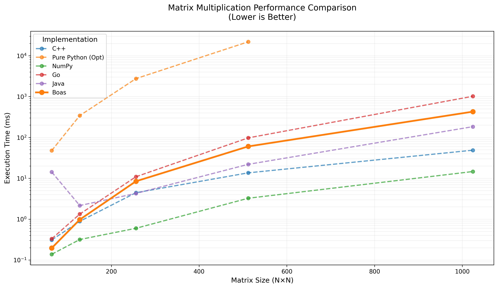

# Boas 编程语言

Boas 是一个基于 MLIR (Multi-Level Intermediate Representation) 开发的现代编程语言，旨在结合多种编程语言的优势，提供卓越的性能和硬件兼容性。

## 主要特性

- **Python 风格语法**: 借鉴 Python 的简洁语法，提供更好的代码可读性
- **C++ 级性能**: 通过 MLIR 优化和静态编译实现高性能执行
- **Rust 内存管理**: 计划引入现代内存管理系统，包含所有权和借用概念
- **Go 并发模型**: 计划支持类似 goroutine 的并发编程模型
- **硬件加速**: 计划支持 GPU 和 NPU 执行 (开发中)

## 当前已实现功能

1. 基础数值运算
2. 矩阵运算
   - 矩阵乘法
   - 基础矩阵操作
3. 基础 I/O
   - print 函数
   - 控制台输出
4. 随机数生成
   - random 模块
   - 基础随机数操作


## 代码示例

### 1. 基础矩阵运算
```python
import tensor

def main():
    # 创建 2x2 矩阵
    A = tensor.create(2,2){1,2,2,3}  # 创建矩阵 [[1,2], [2,3]]
    B = tensor.create(2,2){5,1,7,8}  # 创建矩阵 [[5,1], [7,8]]
    
    # 执行矩阵乘法
    C = tensor.matmul(A, B)
    
    # 打印结果
    print(C)
```

### 2. 随机矩阵性能测试
```python
import tensor

def main():
    # 64 x 64 矩阵运算
    print(1)
    A64 = tensor.random(64, 64)
    B64 = tensor.random(64, 64)
    C64 = tensor.matmul(A64, B64)
    print(2)
    
    # 128 x 128 矩阵运算
    A128 = tensor.random(128, 128)
    B128 = tensor.random(128, 128)
    C128 = tensor.matmul(A128, B128)
    print(3)
    
    # 256 x 256 矩阵运算
    A256 = tensor.random(256, 256)
    B256 = tensor.random(256, 256)
    C256 = tensor.matmul(A256, B256)
    print(4)
    
    # 512 x 512 矩阵运算
    A512 = tensor.random(512, 512)
    B512 = tensor.random(512, 512)
    C512 = tensor.matmul(A512, B512)
    print(5)
    
    # 1024 x 1024 矩阵运算
    A1024 = tensor.random(1024, 1024)
    B1024 = tensor.random(1024, 1024)
    C1024 = tensor.matmul(A1024, B1024)
    print(6)
```

### 主要 API 说明

1. **tensor 模块**
   - `tensor.create(rows, cols){values...}`: 创建指定大小的矩阵并初始化值
   - `tensor.random(rows, cols)`: 创建指定大小的随机矩阵
   - `tensor.matmul(A, B)`: 执行矩阵乘法运算
   - `print(tensor)`: 打印矩阵内容


## 性能测试

### 矩阵乘法性能对比



性能测试结果分析：

1. **当前性能状况**:
   - Boas 目前完成了基础的矩阵运算功能
   - 性能介于 Pure Python 和优化语言之间
   - 在小规模矩阵运算时表现尚可

2. **与其他语言对比**:
   - NumPy (基于优化的 BLAS 库) 性能最优
   - C++ 原生实现次之
   - Java 和 Go 处于中等水平
   - Boas 当前版本有较大优化空间

3. **后续优化方向**:
   - MLIR 优化管道完善
   - 引入向量化支持
   - 添加 GPU 加速
   - 优化内存访问模式
   - 集成高性能计算库

性能测试环境：
- CPU: Intel Core i7-9750H
- Memory: 16GB DDR4
- OS: macOS Monterey 12.3
- Compiler: LLVM 20.0.0
- Matrix Sizes: 64x64 to 1024x1024


## 环境要求

- LLVM 20.0
- Mac Intel 处理器
- CMake >= 3.20
- 支持 C++17 的编译器
- Python >= 3.8 (用于构建和测试)

## LLVM 安装说明

### 方法一：从源码编译（推荐）

1. 下载 LLVM 源码:
```bash
git clone https://github.com/llvm/llvm-project.git
cd llvm-project
git checkout llvmorg-20.0.0
```

2. 创建并进入构建目录:
```bash
mkdir build && cd build
```

3. 配置 CMake:
```bash
cmake -G "Unix Makefiles" \
    -DLLVM_ENABLE_PROJECTS="mlir;clang" \
    -DLLVM_BUILD_EXAMPLES=ON \
    -DLLVM_TARGETS_TO_BUILD="X86;NVPTX;AMDGPU" \
    -DCMAKE_BUILD_TYPE=Release \
    -DLLVM_ENABLE_ASSERTIONS=ON \
    -DCMAKE_INSTALL_PREFIX=/Users/mac/llvm-install \
    ../llvm
```

4. 编译和安装:
```bash
make -j$(nproc)
make install
```

5. 设置环境变量:
```bash
echo 'export PATH="/Users/mac/llvm-install/bin:$PATH"' >> ~/.bashrc
echo 'export LLVM_INSTALL_PATH="/Users/mac/llvm-install"' >> ~/.bashrc
source ~/.bashrc
```

### 方法二：使用包管理器（简单但不推荐）

MacOS (使用 Homebrew):
```bash
brew install llvm@20
```

注意：包管理器安装的版本可能缺少某些必要的组件，建议从源码编译。

### 验证安装

安装完成后，运行以下命令验证:
```bash
llc --version
mlir-opt --version
clang --version
```

所有命令都应该显示版本 20.0.0。

### 常见问题

1. **编译时内存不足**
   - 减少并行编译任务数: 使用 `make -j4` 而不是 `make -j$(nproc)`
   - 增加交换空间

2. **找不到 MLIR 组件**
   - 确保 CMake 配置时包含�� `mlir` 在 `LLVM_ENABLE_PROJECTS` 中
   - 检查安装目录下是否有 `lib/cmake/mlir` 目录

3. **链接错误**
   - 确保环境变量 `LLVM_INSTALL_PATH` 正确设置
   - 检查 CMakeLists.txt 中的库路径配置

## 安装与使用说明

### 编译项目

1. 使用脚本编译:
```bash
# 编译所有模块并运行测试用例
./run.sh -d all -t test/matmul.txt
```

参数说明:
- `-d all`: 编译所有依赖模块
- `-t test/matmul.txt`: 指定测试文件

### 运行程序

执行编译后的程序:
```bash
# 运行矩阵计算程序
./build/matrix-compiler --run benchmark/src/boas_bench.txt
```

### 性能基准测试

运行性能测试套件:
```bash
# 切换到基准测试目录
cd benchmark/script

# 执行基准测试
./run_bench.sh
```


## 开发路线图

- [x] 基础语言特性
  - [x] 矩阵运算
  - [x] 随机数生成
  - [x] 基础输出功能
- [ ] 完整的类型系统
- [ ] 内存安全机制
- [ ] 并发编程支持
- [ ] GPU 后端
- [ ] NPU 支持
- [ ] 包管理系统
- [ ] IDE 支持插件
- [ ] 标准库扩展

## 参与贡献

欢迎参与 Boas 语言的开发！请参考[贡献指南](CONTRIBUTING.md)了解详情。

## 开源协议

Boas 采用 MIT 开源协议。详见 [LICENSE](LICENSE) 文件。

## 社区交流

- GitHub Issues: [boas-lang/boas/issues](https://github.com/boas-lang/boas/issues)
- 技术交流群: [加入 Boas 开发者群](#)
- 邮件列表: [订阅开发者邮件列表](#)

## 致谢

感谢以下开源社区的贡献：
- LLVM/MLIR 社区
- Python 社区
- NumPy 团队
- 以及所有为 Boas 贡献代码的开发者

## 常见问题

1. Q: Boas 目前支持哪些基础运算？
   A: 当前主要支持矩阵乘法、随机数生成和基础打印功能。

2. Q: 什么时候能支持 GPU 计算？
   A: GPU 支持正在开发中，预计在下一个主要版本中发布。

3. Q: 如何参与语言开发？
   A: 可以通过 GitHub 提交 Issue 或 PR，也可以加入开发者群参与讨论。